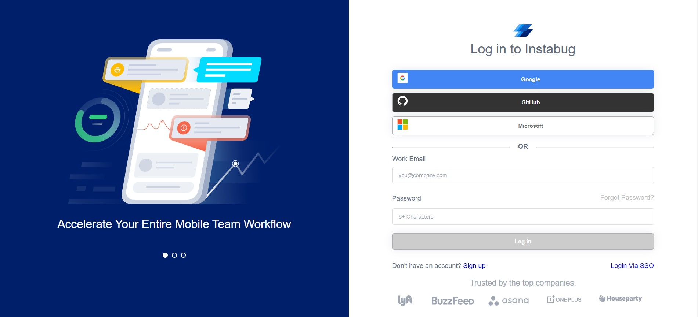
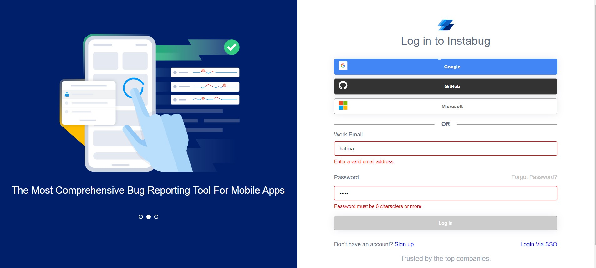

# Instabug_FE_Intern_task

## Table of Contents

- [About the Project](#about)
  - [Build with](#build-with)
- [Getting Started](#getting-started)
  - [Installation](#installation)
  - [Running](#running)
- [Screenshots](#screenshots)
- [Responsive Sreenshots](#responsive-screenshots)
- [Testing](#testing)

## About

> This is a small app including three pages. Login page in which the user cal login using his email and password. The email and password must be valid in order to let him login. if the user entered an email or password not included in the data he will not be able to reach the welcome page.
> The second page is the welcome page which display only a welcome message and a logout button.
> if the user logged out he will be redirected to the login page
> The last page is the 404 page. Which will appear if the user entered any url rather than /login or /welcome

### Build with

- [Vue JS](https://vuejs.org/)
- [BEM Methodology](http://getbem.com/)
- [SCSS](https://sass-lang.com/documentation/)
- [Jest](https://jestjs.io/)
- [Cypress](https://docs.cypress.io/)

## Getting Started

### Installation

1. **_Clone the repository_**

```sh
$ git clone https://github.com/habibamahmoud/Instabug_FE_Intern_Task.git
```

2. **_Navigate to repository directory_**

```sh
$ cd Instabug_FE_Intern_Task.git
```

3. **_Install dependencies_**

```sh
$ npm install
```

### Running

1. **_Compiles and hot-reloads for development_**

```sh
$ npm run serve
```

2. **_Compiles and minifies for production_**

```sh
$ npm run build
```

3. **_Run automation tests_**

```sh
npx cypress open
```

4. **_Run unit tests_**

```sh
npm run test:unit
```

### Screenshots






### Responsive Screenshots


### Testing

> Automation testion using Cypress:

1.       Enter an email address that doesn’t exist in the login list

        Enter any password

        Click on the login button
        Validate that the errormessage ‘you email and/or password are incorrect’ shows

2.       Enter an email address that exists in the login list

        Enter any wrong password

        Click on the login button

        Validate that the error message ‘you email and/or password are incorrect’ shows

3.       Enter an email address that exists in the login list

        Enter the right password

        Click on login button

        Validate that the browser will redirect to the welcome page

4.       Enter not a valid email address ‘dddd’

        Un-focus the textbox

        Validate that the red validation message will appear

        Validate that the textbox border will be red

5.       Enter a right email and password

        Click login button

        Click logout button

        Validate that the browser will redirect to login page

> Unit Testing using Jest:

1.       Validate that the user is not logged in when the login page loaded
2.       Validate that the login button is disabled before entering a valid email and password
3.       Validate that the login page render its components correctly
